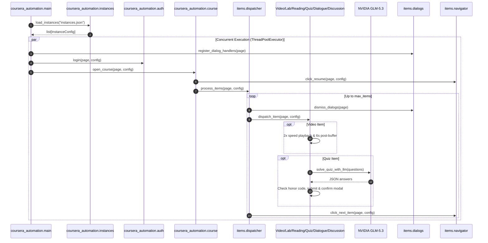

# Architecture & Design

This project automates Coursera workflows using Playwright in Python, strictly adhering to NASA JPL Rule 4 (≤ 60 lines per module) and the 3-step verification loop.

## Architecture

## Modular Decomposition (NASA JPL Rule 4)

- `coursera_automation/config.py`: Environment configuration and typed dataclass.
- `coursera_automation/instances.py`: Multi-instance configuration loading and single-instance fallback.
- `coursera_automation/auth.py`: Authentication interactions with Arkose puzzle manual solve window.
- `coursera_automation/course.py`: Specialization navigation and course entry.
- `coursera_automation/items/video.py`: Conditional 2x speed, in-video question skip, exact duration wait, and 6s buffer.
- `coursera_automation/items/lab.py`: Lab agreement and background app launch (`bring_to_front`).
- `coursera_automation/items/reading.py`: Reading completion via progressive scroll and `data-testid="mark-complete"` click.
- `coursera_automation/items/dialogue.py`: Dialogue start, finish, and modal confirmation.
- `coursera_automation/items/discussion.py`: Discussion response input.
- `coursera_automation/items/quiz_solver.py`: NVIDIA LLM API integration.
- `coursera_automation/items/quiz_parser.py`: Question DOM extraction and classification.
- `coursera_automation/items/quiz_status.py`: Completed/passed quiz detection and progression readiness.
- `coursera_automation/items/quiz_submit.py`: Quiz submission and confirmation modal interaction.
- `coursera_automation/items/quiz.py`: Quiz lifecycle coordination and question solving execution.
- `coursera_automation/items/dialogs.py`: Pendo guide and transient dialog dismissal.
- `coursera_automation/items/navigator.py`: Resume / Get started and next item navigation.
- `coursera_automation/items/dispatcher.py`: Item detection and iteration loop.
- `coursera_automation/main.py`: Concurrent multi-instance browser orchestration via ThreadPoolExecutor.

