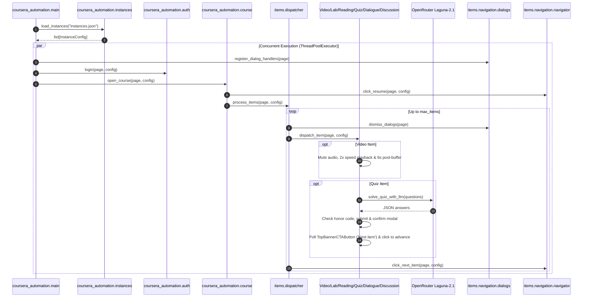

# Architecture & Design

This project automates Coursera workflows using Playwright in Python, strictly adhering to NASA JPL Rule 4 (≤ 60 lines per module) and the 3-step verification loop.

## Architecture

## Modular Decomposition (NASA JPL Rule 4)

- `coursera_automation/config.py`: Environment configuration and typed dataclass.
- `coursera_automation/instances.py`: Multi-instance configuration loading and single-instance fallback.
- `coursera_automation/auth.py`: Authentication interactions with Arkose puzzle manual solve window.
- `coursera_automation/course.py`: Specialization navigation and course entry.
- `coursera_automation/main.py`: Multi-instance orchestration with `playwright-stealth` anti-bot evasion.
- `coursera_automation/items/dispatcher.py`: Top-level item detection and progression iteration loop.
- **Content Subpackage (`items/content/`)**:
  - `video.py`: Video start, audio muting, 2x playback, in-video question skipping, and 6s post-buffer.
  - `reading.py`: Reading completion via progressive scroll and `data-testid="mark-complete"` click.
  - `lab.py`: Lab Honor Code checkbox, bottom scrolling, optional LTI launch, and "Mark as completed".
- **Interactive Subpackage (`items/interactive/`)**:
  - `dialogue.py`: Roleplay / dialogue start, text chat selection, end, and modal confirmation.
  - `discussion.py`: Discussion response input with 10-second post-reply stabilization buffer.
- **Navigation Subpackage (`items/navigation/`)**:
  - `navigator.py`: Resume / Get started and next item progression navigation with direct `href` fallback.
  - `dialogs.py`: Pendo guide, Honor Code, and transient popup dialog dismissal.
- **Quiz Subpackage (`items/quiz/`)**:
  - `coordinator.py`: Complete quiz lifecycle coordination and CTA interactions.
  - `parser.py`: Question DOM extraction and classification.
  - `solver.py`: OpenRouter LLM API integration with `requests` and `tenacity` retry backoff.
  - `status.py`: Completed/passed quiz and review-mode detection.
  - `submit.py`: Quiz submission and modal confirmation dialog handling.
  - `poll.py`: 'TopBannerCTAButton' ("Next item") polling with interval logging and reload on pending evaluation.
