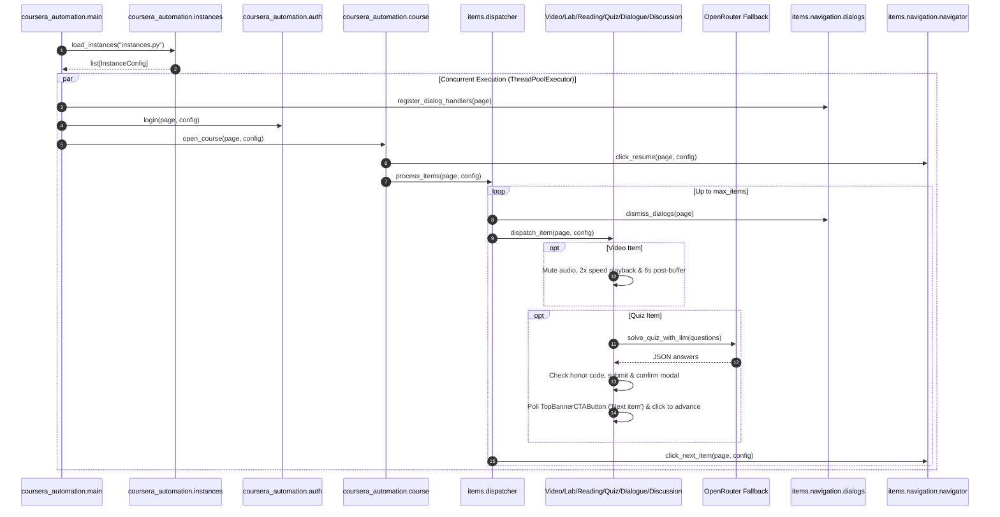

# Architecture & Design

This project automates Coursera workflows using Playwright in Python, strictly adhering to NASA JPL Rule 4 (≤ 60 lines per production module; test suites exempt) and the 3-step verification loop.

## Architecture

## Modular Decomposition (NASA JPL Rule 4 - Production Modules)

- `coursera_automation/config.py`: Environment configuration and typed dataclass.
- `coursera_automation/instances.py`: Multi-instance configuration loading from typed `instances.py` and JSON.
- `coursera_automation/keep_awake.py`: macOS sleep prevention power assertion context manager.
- `coursera_automation/auth.py`: Authentication interactions with Arkose puzzle manual solve window.
- `coursera_automation/course.py`: Specialization navigation, resilient multi-state course entry, and dynamic CTA hydration wait (up to 40s).
- `coursera_automation/main.py`: Multi-instance orchestration with `playwright-stealth` anti-bot evasion and keep-awake integration.
- `coursera_automation/items/dispatcher.py`: Top-level item detection and progression iteration loop with 15s load stabilization wait.
- **Content Subpackage (`items/content/`)**:
  - `video.py`: Video start, audio muting, 2x playback, 0.5s in-video question skip polling, playToggle auto-resume, and 6s post-buffer.
  - `reading.py`: Reading completion via unconditional 60s wait (12 cycles $\times$ 5s scrolling), bottom scroll, and `data-testid="mark-complete"` click.
  - `lab.py`: Lab Honor Code agreement with bounded timeout, bottom scrolling, optional LTI launch, and "Mark as completed".
- **Interactive Subpackage (`items/interactive/`)**:
  - `dialogue.py`: Roleplay / dialogue start, text chat selection, end, modal confirmation, and 15s post-dialogue finalization buffer.
  - `discussion.py`: Discussion response input with 15-second post-reply stabilization buffer.
- **Peer Assignment Subpackage (`items/peer/`)**:
  - `coordinator.py`: Peer-graded assignment skipping and progression navigation (identified strictly by `/peer/` in URL).
- **Navigation Subpackage (`items/navigation/`)**:
  - `resume.py`: Resume and get started course navigation with vertical scrolling and button detection.
  - `navigator.py`: Next item progression navigation checking TopBannerCTAButton when back button is visible, with direct href fallback, and graceful termination on Final Exams.
  - `dialogs.py`: Pendo guide, Honor Code, and transient popup dialog dismissal.
  - `target.py`: Weekly learning target modal handling (checks all days, 5s delay for Save button, saves, and waits 30s for reload).
- **Quiz Subpackage (`items/quiz/`)**:
  - `coordinator.py`: Complete quiz lifecycle coordination ensuring active questions (multiple choice, multiselect, textarea, and exact-match text inputs) are extracted and filled with auto-scrolling, Honor Code is confirmed, tunnel vision Back button is detected, and never bypassed by navigation headers.
  - `json_extractor.py`: Robust JSON extraction and decoding from LLM outputs, stripping `<think>` tags, markdown code blocks, and conversational preambles.
  - `launcher.py`: Quiz attempt initiation with strict precedence for tunnel vision mode (`data-testid="tunnel-vision-back-button"`, `aria-label="Back"`) and active attempt elements (`[data-testid^="part-"]`) over lingering cover CTAs, with explicit support for `"Try again"` retries on evaluation review screens.
  - `loader.py`: Progressive scrolling, expected question count detection, and DOM hydration stabilization.
  - `option_matcher.py`: Robust quiz option resolution and normalization, handling LaTeX/KaTeX math formatting (`*` vs `×`, braces, whitespace), auto-scrolling options into view, and directly checking native radio/checkbox inputs alongside label clicks.
  - `image_extractor.py`: DOM extraction and protocol normalization of `<figure>` diagram URLs from question prompt viewers.
  - `parser.py`: Question DOM extraction scoped to top-level question parts (`[data-testid^="part-"]`), extracting prompt text and image URLs while stripping adversarial AI honeypot instructions.
  - `groq_solver.py`: Groq API solver using `qwen/qwen3.8-27b` (both text and multimodal vision, with reasoning effort omitted for multimodal) via OpenAI-compatible endpoint with tenacity exponential backoff retry.
  - `openrouter_solver.py`: OpenRouter LLM solver with multimodal vision model routing (`nex-agi/nex-n2.5-mini:free`) and multi-model fallback chain (`dots-studio/dots-3-note-preview:free` -> `nex-agi/nex-n2.5-mini:free` -> `openrouter/free` -> `qwen/qwen3.8-27b:free`).
  - `solver.py`: LLM quiz solver orchestrator coordinating batch text solving and per-question multimodal solving using Groq with OpenRouter fallback.
  - `status.py`: Completed/passed quiz and review-mode detection, plus Final Exam header recognition.
  - `submit.py`: Quiz submission, modal confirmation dialog handling, and 3-minute post-submission evaluation DOM stabilization wait.
  - `poll.py`: 'TopBannerCTAButton' polling conditional on tunnel vision back button presence, skipping immediately on Final Exams.
